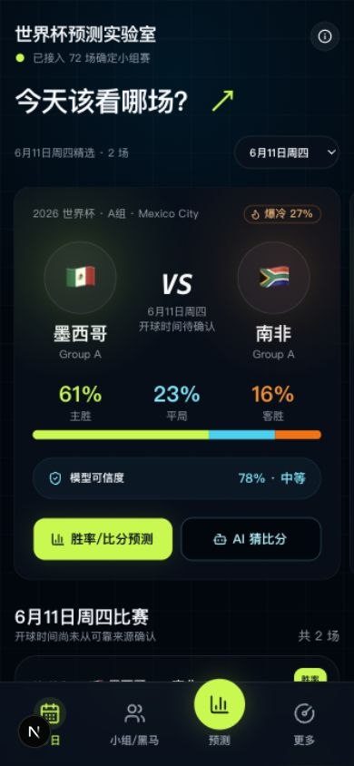
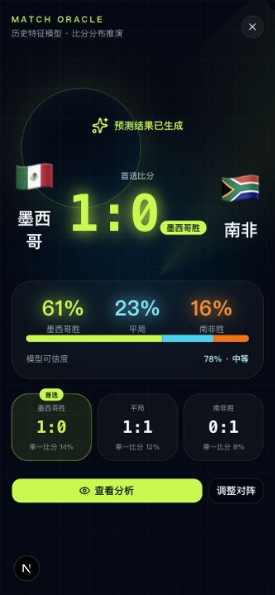

# 世界杯预测实验室

一个面向中文用户、移动端优先的 2026 世界杯观赛与预测网站。项目把赛程、
国家队历史比赛、Elo、近期状态、攻防特征和历史交锋组合成可解释预测，并可选
使用 Gemini 或 OpenAI 兼容 API 生成 AI 比分推演。

> 预测仅供观赛和技术研究参考，不构成投注建议，也不代表比赛真实结果。

## 功能

- 浏览 2026 世界杯小组赛赛程与小组实力
- 查看胜、平、负概率，比分分布和爆冷风险
- 自定义模型权重，观察不同因素如何影响结果
- 使用历史国家队比赛生成近期状态与交锋特征
- 可选开启服务端 Gemini / OpenAI 兼容 AI 比分推演与分享图

## 移动端预览

<p align="center">
  
  
</p>

## 技术栈

- Next.js 16 App Router、React 19、TypeScript
- Tailwind CSS 4、Base UI、shadcn/ui
- Docker standalone 构建，可部署到 Vercel 或自托管 Node.js 服务

## 本地运行

需要 Node.js 22。

```bash
git clone https://github.com/EDWINCHENC/world-cup-2026-lab.git
cd world-cup-2026-lab
npm ci
npm run dev
```

打开 [http://localhost:3000](http://localhost:3000)。不配置 API Key 时，普通的
赛程、模型预测和数据页面仍可使用，只有“AI 猜比分”不可用。

## API Key 配置

复制示例文件，并只在本机或部署平台的服务端环境变量中填写密钥：

```bash
cp .env.example .env.local
```

| 变量 | 必需 | 说明 |
| --- | --- | --- |
| `AI_PROVIDER` | 否 | `gemini` 或 `openai`，默认 `gemini` |
| `GEMINI_API_KEY` | Gemini 模式必需 | 服务端 Gemini API Key |
| `GEMINI_API_BASE_URL` | 否 | 默认使用 Gemini 官方 API；也可填写兼容代理 |
| `GEMINI_MODEL` | 否 | 默认 `gemini-3-flash-preview` |
| `OPENAI_API_KEY` | OpenAI 模式必需 | OpenAI 或兼容服务的 API Key |
| `OPENAI_API_BASE_URL` | 否 | 默认 `https://api.openai.com/v1`，可填写兼容服务地址 |
| `OPENAI_MODEL` | 否 | OpenAI 兼容服务使用的模型名 |
| `OPENAI_JSON_MODE` | 否 | 默认 `true`；兼容服务不支持 JSON mode 时设为 `false` |
| `AI_SCORE_ENABLED` | 否 | 设置为 `false` 可立即关闭 AI 调用 |
| `AI_SCORE_REQUESTS_PER_MINUTE` | 否 | 单 IP 每分钟调用上限，默认 `8` |
| `AI_SCORE_CACHE_TTL_SECONDS` | 否 | AI 结果内存缓存时间，默认 `43200` 秒 |

Gemini 示例：

```bash
AI_PROVIDER=gemini
GEMINI_API_KEY=your-key
GEMINI_MODEL=gemini-3-flash-preview
```

OpenAI 兼容 API 示例：

```bash
AI_PROVIDER=openai
OPENAI_API_KEY=your-key
OPENAI_API_BASE_URL=https://api.openai.com/v1
OPENAI_MODEL=gpt-4.1-mini
```

OpenAI 兼容模式调用 `${OPENAI_API_BASE_URL}/chat/completions`。如果服务不支持
`response_format: json_object`，请设置 `OPENAI_JSON_MODE=false`。

密钥只由 [`/api/ai-score`](src/app/api/ai-score/route.ts) 在服务端读取，不会打包进
浏览器。请勿给密钥添加 `NEXT_PUBLIC_` 前缀，也不要提交 `.env.local` 或
`.env.production`。

公开部署会让访客消耗部署者的 API 配额。仓库内置的是单实例内存限流和缓存；
正式公开服务还应在 Vercel、防火墙或反向代理层增加限流、预算告警和供应商配额。
详见 [SECURITY.md](SECURITY.md)。

## 部署

### Vercel

1. 将仓库导入 Vercel。
2. 在项目设置中按需添加上表环境变量。
3. 使用默认的 `npm run build` 部署。

这是包含 Route Handler 的动态 Next.js 应用，不能部署为纯静态站点。

### Docker

```bash
cp .env.example .env.production
# 按需编辑 .env.production
docker compose -f deploy/compose.yml up -d --build
```

容器仅绑定到 `127.0.0.1:3000`，推荐使用 Caddy、nginx 等反向代理公开服务。
示例 Caddy 配置：

```bash
DOMAIN=worldcup.example.com caddy run --config deploy/Caddyfile
```

## 开发与数据更新

```bash
npm run lint
npm run build
npm run data:history
npm run data:schedule
```

历史比赛数据来自
[`martj42/international_results`](https://github.com/martj42/international_results)，
采用 CC0-1.0；完整来源、许可和刷新方式见 [data/README.md](data/README.md)。
赛程基于项目内数据，并参考 FIFA 官方赛程进行核对。

## 参与贡献

欢迎提交 Issue 和 Pull Request。开始前请阅读 [CONTRIBUTING.md](CONTRIBUTING.md)
与 [SECURITY.md](SECURITY.md)。

## 许可

项目代码采用 [MIT License](LICENSE)。第三方历史比赛数据采用其目录中注明的
CC0-1.0 许可。
